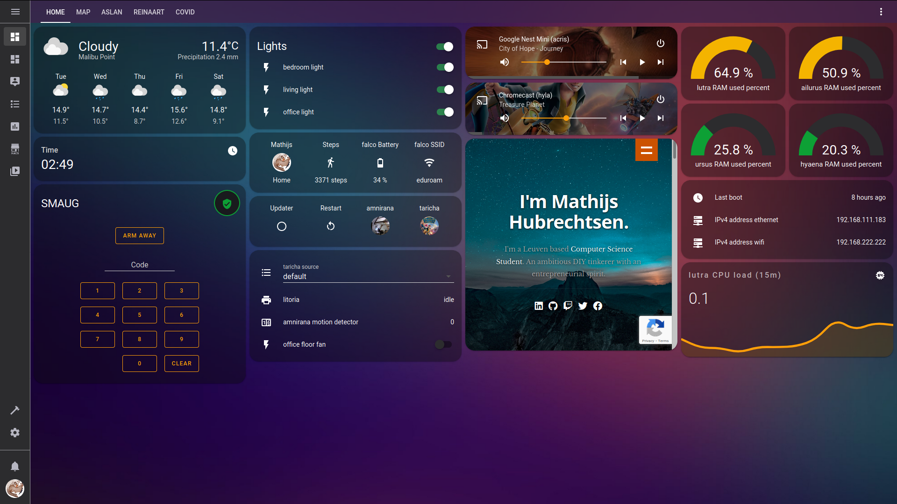
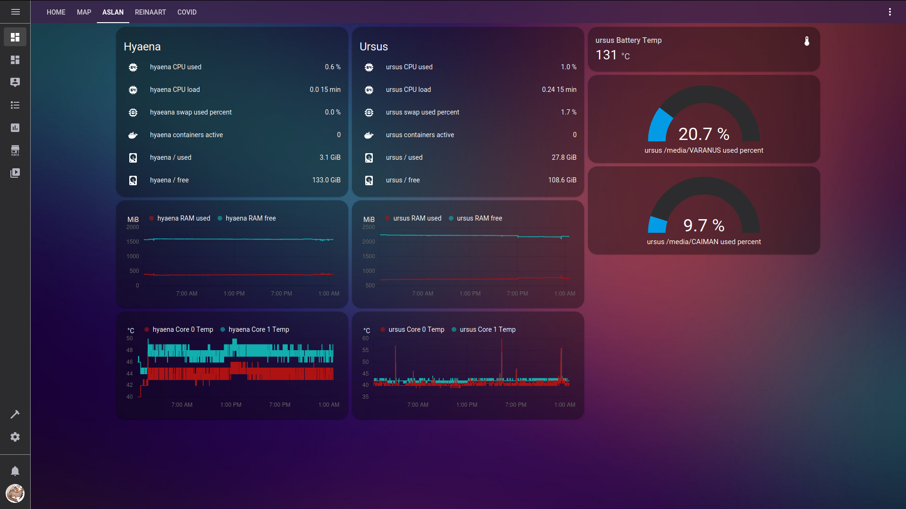
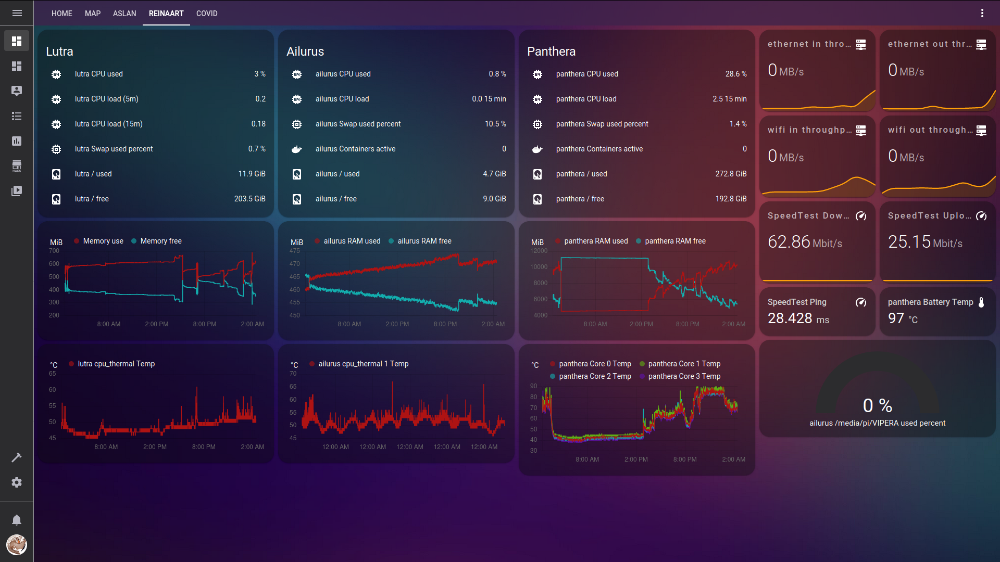

# Malibu-Point-HA
Home-Assistant Configuration for the Malibu Point infrastructure.
Malibu Point is an IoT infrastructure deployed on a personal computer network called zoo-net.
It's part of my overall IT infrastructure called zoo.
Most of the config file is split up into different components that can be found in the `includes/` directory.
There's also a custom component (SMAUG) which I like to play around with that can be found in `custom_components/`.
SMAUG (Some Majestic Alarm Unit Guard) is an alarm control panel that I used to delve into the actual code part of Home Assistant.
`www/` is used to provide public resources.
Look down below for more information!

## Screenshots

### Home View


### aslan Network View


### reinaart Network View



## Naming System
Malibu Point makes use of an unusual naming system, this is mostly because I oftentimes make completely custom components or use devices that aren't typically used in a smart home.
The Naming System is based on animal taxonomy.

* Amphibians: Actual IoT devices.
    * Salamanders: custom built IoT devices.
        * **taricha:** Old Panasonic TV
    * Frogs: off-the-shelf IoT devices
        * **amnirana:** DCS-5020L Camera
        * **litoria:** HP Color LaserJet Pro MFP M177fw
        * **hyla:** Chromecast
        * **acris:** Google Nest Mini (2nd gen)
* Mammals: represent more traditional computing devices.
    * **ursus:** main public server
    * **ailurus:** raspberry pi
    * **panthera:** main workstation
    * **hyaena:** secondary public server
* Birds: mobile devices.
    * **falco:** iPhone
* Sea Creatures: network devices (routers, switches, etc.).
* Reptilians: storage devices (usbs, sd-cards, etc.).
   * **varanus:** ursus back-up drive
   * **caiman:** external SD card
   * **vipera:** external SD card


## Lovelace

### Configuration
See `lovelace-ui.yaml`

### Integrations
* **Meteorologisk institutt (Met.no)**
* **Google Cast**
    * hyla: Chromcast
    * acris: Google Nest Mini (2nd gen)
* **Internet Printing Protocol (IPP)**
    * litoria: main ipp queue of the physical printer
    * litoria-auto-fax: fax queue generated on ailurus CUPS server
    * litoria-auto-print: print queue generated on ailurus CUPS server
* **Coronavirus (COVID-19)**
* **HACS**
* **Speedtest.net**
* **Mobile App**

## Home Assistant Community Store (HACS)

### Integrations
* `custom_components/hacs`
* `custom_components/favicon`

### Lovelace
* `www/community/custom_header`
* `www/community/mini-graph-card`
* `www/community/mini-media-player`

### Themes
* `themes/clear`
* `themes/clear-dark`
* `themes/dark_teal`
* `themes/google_dark_theme`
* `themes/google_light_theme`
* `themes/ios-themes`

## Installing and Updating Home Assistant via docker
```
(For Installing, only steps 3 and 4 are important)
1. docker stop home-assistant
2. docker rm home-assistant
3. docker pull homeassistant/home-assistant
4. docker run -d --network=host --name home-assistant -v <path_to_config_folder>:/config  homeassistant/home-assistant
```
